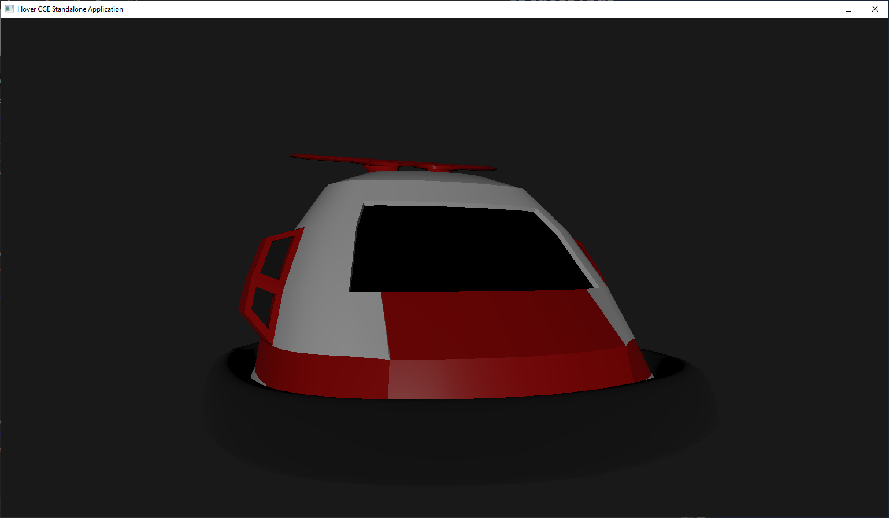

# Hover

A simple multi-platform demo application using [Castle Game Engine](https://castle-engine.io/)

### Press the spacebar while it's running

This project is Lazarus, command-like and build-tool friendly

##### To compile with Lazarus (the only option for MacOS)

Load HoverLaz.lpi into Lazarus + compile

##### To compile with Castle-Editor

Open CastleEngineManifest.xml in Castle Editor and select Compile And Run from the Run menu item

##### To compile from the command line for Windows/Linux

castle-engine compile

HoverApp

##### To compile from the command line for Android

castle-engine package  --target=android

Install lpk on a device

##### To compile from the command line for iOS

castle-engine package  --target=ios

Install lpk on a device or use simulator

##### Credits

Original model supplied by [Stuck Up Creations](https://stuckupcreations.itch.io/)

